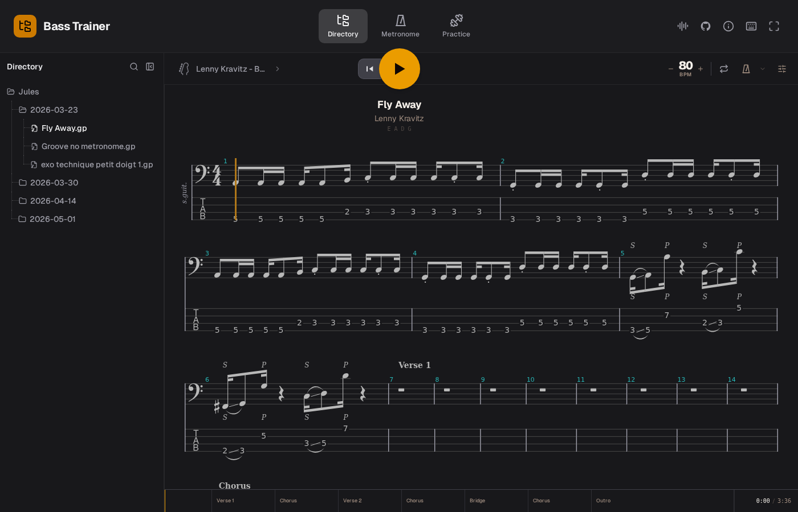

# Bass Trainer



**Personal project for my own bass practice — not designed for general use.**

A browser-based practice tool for bass. Browse your Guitar Pro files, play along with interactive tablature, and drill ear training.

## Features

- **GP file browser** — drop Guitar Pro files into `repository-exercises/` and they appear in the sidebar automatically
- **Interactive score** — standard notation + tab, loop any section, adjust tempo, toggle metronome and count-in
- **Practice hub** — ear training for notes, intervals, scales, and chord changes
- **Chromatic tuner** — visual needle with note detection
- **Standalone metronome** — configurable accent, click sound, and subdivisions

## Adding your own files

Put Guitar Pro files anywhere under `repository-exercises/`:

```
repository-exercises/
└── Jules/
    └── 2026-03-23/
        ├── Fly Away.gp
        └── groove exercise.gp
```

They show up after a page reload (Vite picks them up at build time).

## Getting started

```bash
npm install
npm run dev
```

## Keyboard shortcuts

| Key | Action |
|-----|--------|
| `Space` | Play / Pause |
| `Esc` | Stop |
| `L` | Toggle loop |
| `M` | Toggle metronome |
| `F` | Fullscreen |
| `← / →` | Previous / next bar |
| `↑ / ↓` | Previous / next line |

## Stack

React · TypeScript · Vite · AlphaTab · Web Audio API
